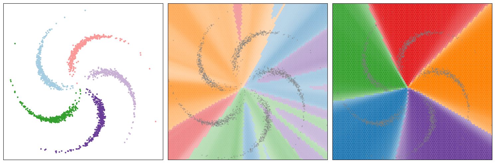

2D Classification
=================

Source: ``examples/classification_2d/main.py``

Overview
--------

A small classifier learns to separate a 2D *pinwheel* dataset — several
interleaved spiral arms, one per class. The example demonstrates
multi-class cross-entropy loss, accuracy estimation, and decision-boundary
visualisation.

Running
-------

::

    python -m examples.classification_2d.main          # defaults
    python -m examples.classification_2d.main --help   # see all options

Selected options:

- ``--num-steps`` — training steps (default 3 000)
- ``--num-classes`` — number of pinwheel arms / classes (default 5)
- ``--hidden-dim`` — width of each hidden layer (default 64)
- ``--plot`` — generate a decision-boundary figure at the end

Code walkthrough
----------------

**Dataset**

The pinwheel dataset produces 2D points arranged in interleaved spiral
arms::

    dataset = PinwheelDataset(num_classes=5, samples_per_class=512, ...)
    # dataset.data: Array (N, 2), dataset.targets: Array (N,) int

**Model**

A three-layer network defined as a ``Module`` subclass::

    class Classifier(nn.Module):
        def __init__(self, input_dim, output_dim, hidden_dim):
            super().__init__()
            self.linear1 = nn.Linear(input_dim, hidden_dim)
            self.linear2 = nn.Linear(hidden_dim, hidden_dim)
            self.linear3 = nn.Linear(hidden_dim, output_dim)

        def forward(self, x):
            x = npg.tanh(self.linear1(x))
            x = npg.tanh(self.linear2(x))
            return self.linear3(x)

**Loss and accuracy**

Cross-entropy on raw logits::

    loss = nn.cross_entropy_loss(net(x), y)

Accuracy from argmax predictions::

    correct = npg.sum(npg.argmax(net(x), axis=1) == y).item()

**Training loop**

::

    optimizer = npg.optim.AdamW(net.parameters())
    for step in range(num_steps):
        x, y = next(iter(train_dataloader))
        optimizer.zero_grad()
        loss = nn.cross_entropy_loss(net(x), y)
        loss.backward()
        optimizer.step()
