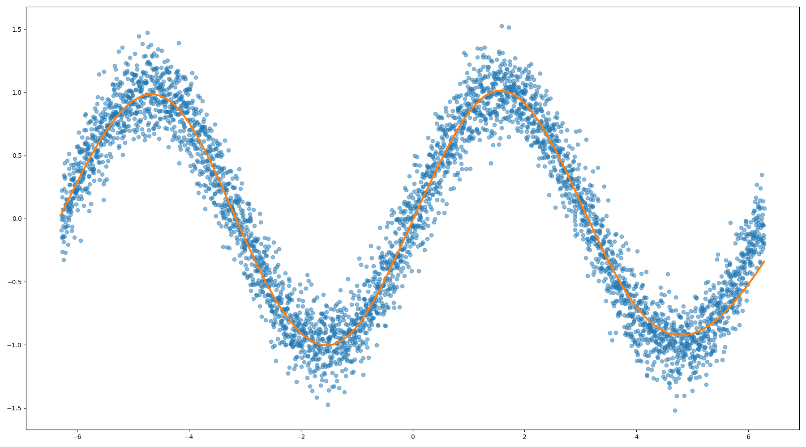

1D Regression
=============

Source: ``examples/regression_1d/main.py``

Overview
--------

A small MLP learns to fit a noisy 1D scalar function. The target is a
smooth non-linear curve with additive Gaussian noise. The example shows
the full training loop pattern: dataset → dataloader → model →
optimizer → loss → backward → step.

The learned fit is optionally visualised with matplotlib:

Running
-------

::

    python -m examples.regression_1d.main          # defaults
    python -m examples.regression_1d.main --help   # see all options

Selected options:

- ``--num-steps`` — training steps (default 3 000)
- ``--hidden-sizes 64 64`` — MLP hidden layer widths
- ``--activation tanh`` — activation (``relu`` / ``tanh`` / ``sigmoid``)
- ``--optimizer adamw`` — ``sgd`` or ``adamw``
- ``--snr-db 12`` — signal-to-noise ratio of the synthetic data

Code walkthrough
----------------

**Dataset**

The dataset generates noisy samples of a fixed smooth function::

    dataset = RegressionDataset(num_examples=4096, snr_db=12)
    # dataset.data: Array (N, 1), dataset.targets: Array (N, 1)

**Model and optimiser**

``nn.MLP`` stacks Linear layers with a chosen activation::

    net = nn.MLP(input_dim=1, hidden_sizes=[64, 64], output_dim=1, activation="tanh")
    optimizer = npg.optim.AdamW(net.parameters())

**Training loop**

::

    for step in range(num_steps):
        x, y = next(iter(train_dataloader))
        optimizer.zero_grad()
        out = net(x)
        loss = nn.mse(out, y)
        loss.backward()
        optimizer.step()

**Evaluation with no_grad**

The ``@npg.no_grad()`` decorator prevents any computation graph from
being built during evaluation, saving memory and time::

    @npg.no_grad()
    def estimate_loss(num_batches, loader):
        losses = [nn.mse(net(x), y).item() for x, y in ...]
        return npg.mean(npg.array(losses)).item()
